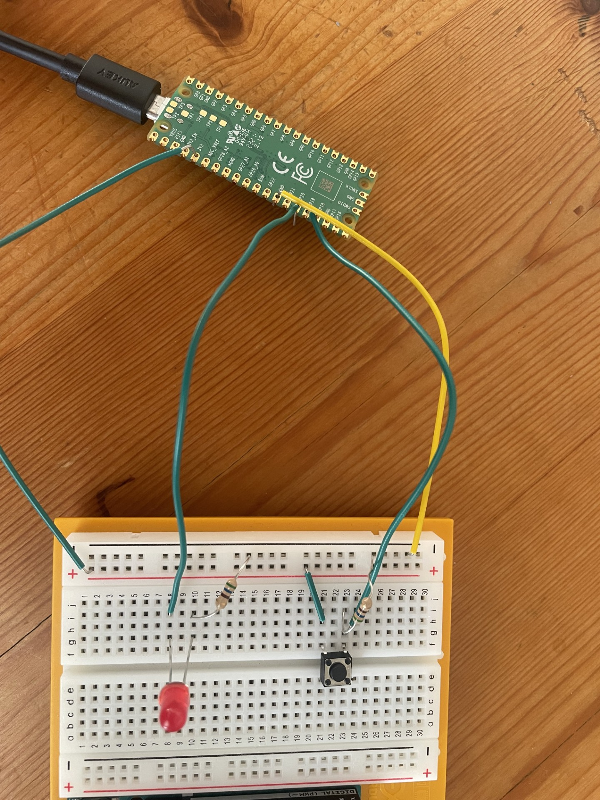

# Blinky for the Raspberry Pi Pico

## How to build blinky and blinkyBtn

Run the following commands

```sh
make pico-sdk
make build
```

To copy the applications on to the Raspberry Pi Pico mount it and then copy one of the following uf2 files to the device:
- build/blinky.uf2
- build/blinkyBtn.uf2


For BlinkyBtn to work properly an external LED and a button must be connected to the following GPIO pins:
- Button: GP19
- External LED: GP20


